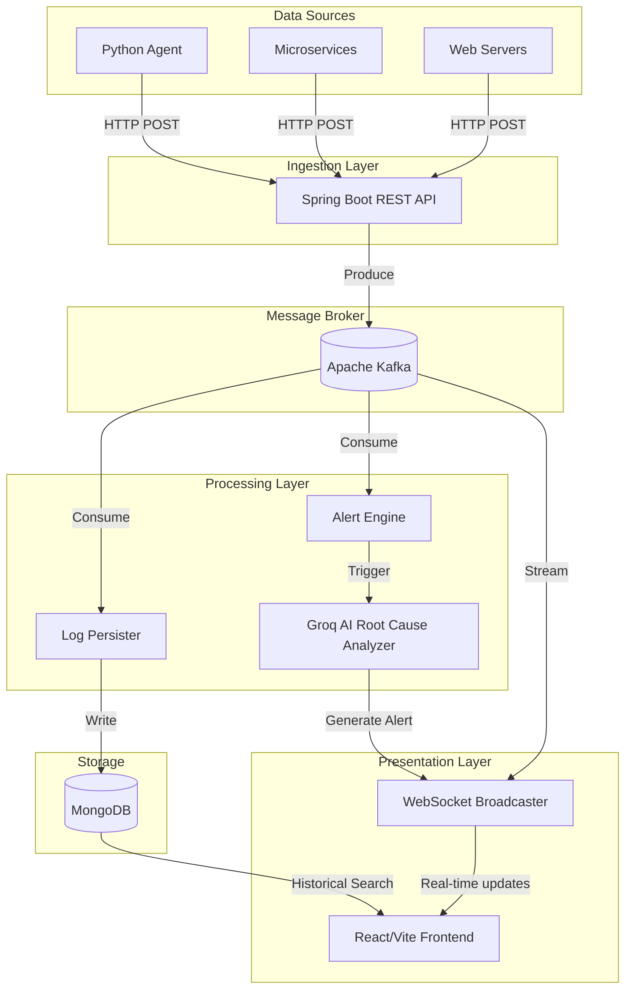

# LogFlow

LogFlow is a highly scalable, real-time log aggregation and analysis platform. It is designed to ingest high-throughput log data from distributed applications, persist it reliably, and provide real-time streaming and AI-driven root cause analysis through a modern web interface.

## Architecture Overview

LogFlow is built on a modern, decoupled architecture utilizing event-driven microservices.



### Core Components

1. **Ingestion API**: A Spring Boot application exposing RESTful endpoints (`/api/v1/logs/ingest`) for receiving log entries. It acts as a lightweight producer, immediately pushing incoming data to Kafka topics based on log severity.
2. **Apache Kafka**: Acts as the central nervous system, decoupling the ingestion of logs from their processing. It ensures durability and handles traffic spikes without overwhelming downstream systems.
3. **Processing Consumers**:
   - **Log Persister**: Consumes logs from Kafka topics and persists them in MongoDB for historical search and retention.
   - **Alert Engine**: Monitors error rates in real-time. Upon detecting anomalies (e.g., consecutive errors), it interfaces with the Groq AI API to generate automated root cause analysis.
4. **Data Storage**: MongoDB is utilized for its flexible schema and efficient indexing capabilities, storing both historical logs and generated alerts.
5. **Presentation Layer**: A React frontend built with Vite. It establishes a WebSocket connection to the backend to receive real-time log streams and AI alerts, bypassing the need for manual polling.

## Integration

LogFlow is designed to be completely agnostic to the data source. While a reference Python agent (`logflow_agent.py`) is provided for file tailing, any application capable of making HTTP requests can transmit logs to the system.

### Sending Logs Programmatically

To integrate LogFlow into your applications, send a POST request containing a JSON array of log objects to the ingestion endpoint.

**Endpoint**: `POST /api/v1/logs/ingest/batch`

**Payload Structure**:
```json
[
  {
    "serviceName": "authentication-service",
    "level": "ERROR",
    "message": "Failed to connect to primary database replica",
    "timestamp": "1706789012345"
  }
]
```

**cURL Example**:
```bash
curl -X POST https://logflow-hav4.onrender.com/api/v1/logs/ingest/batch \
     -H "Content-Type: application/json" \
     -d '[{"serviceName":"payment-gateway","level":"INFO","message":"Transaction approved","timestamp":"'$(date +%s%3N)'"}]'
```

## Security and Access

Currently, LogFlow is deployed as an open system for demonstration purposes:
- **Ingestion**: The REST API does not require an API key or authentication token. Any client that knows the endpoint URL can push logs.
- **Dashboard Access**: The frontend web application is accessible to the public. Any visitor to the Vercel deployment URL can view the live log stream, historical data, and AI alerts.

For production deployments, it is recommended to implement an authentication layer (such as OAuth2 or JWT) on the Spring Boot API, and restrict dashboard access via an Identity Provider.

## Technology Stack

- **Backend**: Java 21, Spring Boot 3, Spring Data MongoDB, Spring Kafka, Spring WebSocket
- **Frontend**: React 18, Vite, Tailwind CSS, Lucide Icons, STOMP.js
- **Infrastructure**: Apache Kafka (Aiven), MongoDB (Atlas), Render (Backend Hosting), Vercel (Frontend Hosting)
- **AI Integration**: Groq API (LLaMA 3)
